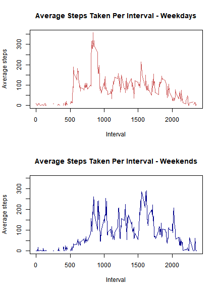

#Course Project- Week 2
###Coursera- Reproducible Research 
Meredith C Henderson


###Preparation: Download the data and unzip the file contents.


```r
Filename<-"Activity.zip"
if(!file.exists(Filename)){
    Url<-"https://d396qusza40orc.cloudfront.net/repdata%2Fdata%2Factivity.zip"
    download.file(Url,Filename)
}

if(!file.exists("Activity_Data")){
    unzip(Filename,exdir="Activity_Data")
}
```


###Part 1: Load the data using read.csv(). Convert the "date" variable from factor to date format and the "steps" variable to numeric, I'm using str() before and after to confirm the conversion.

```r
activity<-read.csv("./Activity_Data/activity.csv")
str(activity)
```

```
## 'data.frame':	17568 obs. of  3 variables:
##  $ steps   : int  NA NA NA NA NA NA NA NA NA NA ...
##  $ date    : Factor w/ 61 levels "2012-10-01","2012-10-02",..: 1 1 1 1 1 1 1 1 1 1 ...
##  $ interval: int  0 5 10 15 20 25 30 35 40 45 ...
```

```r
activity$date<-as.Date(as.factor(activity$date))
activity$steps<-as.numeric(activity$steps)
str(activity)
```

```
## 'data.frame':	17568 obs. of  3 variables:
##  $ steps   : num  NA NA NA NA NA NA NA NA NA NA ...
##  $ date    : Date, format: "2012-10-01" "2012-10-01" ...
##  $ interval: int  0 5 10 15 20 25 30 35 40 45 ...
```


###Part 2: Create a histogram that shows the total number of steps taken per day. The x-axis shows a number range that represents the total number of steps taken in a day. The y-axis shows how many days had totals that fell within that range.  

```r
plot1<-with(activity,tapply(steps,list(date), FUN = sum))
hist(plot1, col="cyan3",
     xlab="Steps", main="Total Steps Taken Per Day")
```


###Part 3: Create a table showing the mean and median steps taken per day.  I'm using the "kableExtra" package, which is similar to "knitr" but allows for more customization. 

```r
library(data.table)
DT<-data.table(activity, key="date")
DT2<-DT[,c("Mean","Median"):= list(mean(steps[steps!=0]), median(steps[steps!=0])), by=list(date)]
DT2<-DT[,list(Mean=mean(steps[steps!=0]), Median=median(steps[steps!=0])), by=list(date)]
library(kableExtra)
kable(DT2, align = "c") %>%
  kable_styling(bootstrap_options = c("striped","hover","condensed"), full_width = F) %>%
    column_spec(1, width = "8em", border_left = T, border_right = T) %>%
    column_spec(2, width = "12em", border_right = T) %>%
    column_spec(3, width= "8em", border_right = T)
```

<table class="table table-striped table-hover table-condensed" style="width: auto !important; margin-left: auto; margin-right: auto;">
 <thead>
  <tr>
   <th style="text-align:center;"> date </th>
   <th style="text-align:center;"> Mean </th>
   <th style="text-align:center;"> Median </th>
  </tr>
 </thead>
<tbody>
  <tr>
   <td style="text-align:center;width: 8em; border-left:1px solid;border-right:1px solid;"> 2012-10-01 </td>
   <td style="text-align:center;width: 12em; border-right:1px solid;"> NA </td>
   <td style="text-align:center;width: 8em; border-right:1px solid;"> NA </td>
  </tr>
  <tr>
   <td style="text-align:center;width: 8em; border-left:1px solid;border-right:1px solid;"> 2012-10-02 </td>
   <td style="text-align:center;width: 12em; border-right:1px solid;"> 63.00000 </td>
   <td style="text-align:center;width: 8em; border-right:1px solid;"> 63.0 </td>
  </tr>
  <tr>
   <td style="text-align:center;width: 8em; border-left:1px solid;border-right:1px solid;"> 2012-10-03 </td>
   <td style="text-align:center;width: 12em; border-right:1px solid;"> 140.14815 </td>
   <td style="text-align:center;width: 8em; border-right:1px solid;"> 61.0 </td>
  </tr>
  <tr>
   <td style="text-align:center;width: 8em; border-left:1px solid;border-right:1px solid;"> 2012-10-04 </td>
   <td style="text-align:center;width: 12em; border-right:1px solid;"> 121.16000 </td>
   <td style="text-align:center;width: 8em; border-right:1px solid;"> 56.5 </td>
  </tr>
  <tr>
   <td style="text-align:center;width: 8em; border-left:1px solid;border-right:1px solid;"> 2012-10-05 </td>
   <td style="text-align:center;width: 12em; border-right:1px solid;"> 154.58140 </td>
   <td style="text-align:center;width: 8em; border-right:1px solid;"> 66.0 </td>
  </tr>
  <tr>
   <td style="text-align:center;width: 8em; border-left:1px solid;border-right:1px solid;"> 2012-10-06 </td>
   <td style="text-align:center;width: 12em; border-right:1px solid;"> 145.47170 </td>
   <td style="text-align:center;width: 8em; border-right:1px solid;"> 67.0 </td>
  </tr>
  <tr>
   <td style="text-align:center;width: 8em; border-left:1px solid;border-right:1px solid;"> 2012-10-07 </td>
   <td style="text-align:center;width: 12em; border-right:1px solid;"> 101.99074 </td>
   <td style="text-align:center;width: 8em; border-right:1px solid;"> 52.5 </td>
  </tr>
  <tr>
   <td style="text-align:center;width: 8em; border-left:1px solid;border-right:1px solid;"> 2012-10-08 </td>
   <td style="text-align:center;width: 12em; border-right:1px solid;"> NA </td>
   <td style="text-align:center;width: 8em; border-right:1px solid;"> NA </td>
  </tr>
  <tr>
   <td style="text-align:center;width: 8em; border-left:1px solid;border-right:1px solid;"> 2012-10-09 </td>
   <td style="text-align:center;width: 12em; border-right:1px solid;"> 134.85263 </td>
   <td style="text-align:center;width: 8em; border-right:1px solid;"> 48.0 </td>
  </tr>
  <tr>
   <td style="text-align:center;width: 8em; border-left:1px solid;border-right:1px solid;"> 2012-10-10 </td>
   <td style="text-align:center;width: 12em; border-right:1px solid;"> 95.19231 </td>
   <td style="text-align:center;width: 8em; border-right:1px solid;"> 56.5 </td>
  </tr>
  <tr>
   <td style="text-align:center;width: 8em; border-left:1px solid;border-right:1px solid;"> 2012-10-11 </td>
   <td style="text-align:center;width: 12em; border-right:1px solid;"> 137.38667 </td>
   <td style="text-align:center;width: 8em; border-right:1px solid;"> 35.0 </td>
  </tr>
  <tr>
   <td style="text-align:center;width: 8em; border-left:1px solid;border-right:1px solid;"> 2012-10-12 </td>
   <td style="text-align:center;width: 12em; border-right:1px solid;"> 156.59459 </td>
   <td style="text-align:center;width: 8em; border-right:1px solid;"> 46.0 </td>
  </tr>
  <tr>
   <td style="text-align:center;width: 8em; border-left:1px solid;border-right:1px solid;"> 2012-10-13 </td>
   <td style="text-align:center;width: 12em; border-right:1px solid;"> 119.48077 </td>
   <td style="text-align:center;width: 8em; border-right:1px solid;"> 45.5 </td>
  </tr>
  <tr>
   <td style="text-align:center;width: 8em; border-left:1px solid;border-right:1px solid;"> 2012-10-14 </td>
   <td style="text-align:center;width: 12em; border-right:1px solid;"> 160.61702 </td>
   <td style="text-align:center;width: 8em; border-right:1px solid;"> 60.5 </td>
  </tr>
  <tr>
   <td style="text-align:center;width: 8em; border-left:1px solid;border-right:1px solid;"> 2012-10-15 </td>
   <td style="text-align:center;width: 12em; border-right:1px solid;"> 131.67532 </td>
   <td style="text-align:center;width: 8em; border-right:1px solid;"> 54.0 </td>
  </tr>
  <tr>
   <td style="text-align:center;width: 8em; border-left:1px solid;border-right:1px solid;"> 2012-10-16 </td>
   <td style="text-align:center;width: 12em; border-right:1px solid;"> 157.12500 </td>
   <td style="text-align:center;width: 8em; border-right:1px solid;"> 64.0 </td>
  </tr>
  <tr>
   <td style="text-align:center;width: 8em; border-left:1px solid;border-right:1px solid;"> 2012-10-17 </td>
   <td style="text-align:center;width: 12em; border-right:1px solid;"> 152.86364 </td>
   <td style="text-align:center;width: 8em; border-right:1px solid;"> 61.5 </td>
  </tr>
  <tr>
   <td style="text-align:center;width: 8em; border-left:1px solid;border-right:1px solid;"> 2012-10-18 </td>
   <td style="text-align:center;width: 12em; border-right:1px solid;"> 152.36364 </td>
   <td style="text-align:center;width: 8em; border-right:1px solid;"> 52.5 </td>
  </tr>
  <tr>
   <td style="text-align:center;width: 8em; border-left:1px solid;border-right:1px solid;"> 2012-10-19 </td>
   <td style="text-align:center;width: 12em; border-right:1px solid;"> 127.19355 </td>
   <td style="text-align:center;width: 8em; border-right:1px solid;"> 74.0 </td>
  </tr>
  <tr>
   <td style="text-align:center;width: 8em; border-left:1px solid;border-right:1px solid;"> 2012-10-20 </td>
   <td style="text-align:center;width: 12em; border-right:1px solid;"> 125.24096 </td>
   <td style="text-align:center;width: 8em; border-right:1px solid;"> 49.0 </td>
  </tr>
  <tr>
   <td style="text-align:center;width: 8em; border-left:1px solid;border-right:1px solid;"> 2012-10-21 </td>
   <td style="text-align:center;width: 12em; border-right:1px solid;"> 96.93407 </td>
   <td style="text-align:center;width: 8em; border-right:1px solid;"> 48.0 </td>
  </tr>
  <tr>
   <td style="text-align:center;width: 8em; border-left:1px solid;border-right:1px solid;"> 2012-10-22 </td>
   <td style="text-align:center;width: 12em; border-right:1px solid;"> 154.71264 </td>
   <td style="text-align:center;width: 8em; border-right:1px solid;"> 52.0 </td>
  </tr>
  <tr>
   <td style="text-align:center;width: 8em; border-left:1px solid;border-right:1px solid;"> 2012-10-23 </td>
   <td style="text-align:center;width: 12em; border-right:1px solid;"> 101.34091 </td>
   <td style="text-align:center;width: 8em; border-right:1px solid;"> 56.0 </td>
  </tr>
  <tr>
   <td style="text-align:center;width: 8em; border-left:1px solid;border-right:1px solid;"> 2012-10-24 </td>
   <td style="text-align:center;width: 12em; border-right:1px solid;"> 104.43750 </td>
   <td style="text-align:center;width: 8em; border-right:1px solid;"> 51.5 </td>
  </tr>
  <tr>
   <td style="text-align:center;width: 8em; border-left:1px solid;border-right:1px solid;"> 2012-10-25 </td>
   <td style="text-align:center;width: 12em; border-right:1px solid;"> 56.63636 </td>
   <td style="text-align:center;width: 8em; border-right:1px solid;"> 35.0 </td>
  </tr>
  <tr>
   <td style="text-align:center;width: 8em; border-left:1px solid;border-right:1px solid;"> 2012-10-26 </td>
   <td style="text-align:center;width: 12em; border-right:1px solid;"> 77.02273 </td>
   <td style="text-align:center;width: 8em; border-right:1px solid;"> 36.5 </td>
  </tr>
  <tr>
   <td style="text-align:center;width: 8em; border-left:1px solid;border-right:1px solid;"> 2012-10-27 </td>
   <td style="text-align:center;width: 12em; border-right:1px solid;"> 134.92000 </td>
   <td style="text-align:center;width: 8em; border-right:1px solid;"> 72.0 </td>
  </tr>
  <tr>
   <td style="text-align:center;width: 8em; border-left:1px solid;border-right:1px solid;"> 2012-10-28 </td>
   <td style="text-align:center;width: 12em; border-right:1px solid;"> 110.17308 </td>
   <td style="text-align:center;width: 8em; border-right:1px solid;"> 61.0 </td>
  </tr>
  <tr>
   <td style="text-align:center;width: 8em; border-left:1px solid;border-right:1px solid;"> 2012-10-29 </td>
   <td style="text-align:center;width: 12em; border-right:1px solid;"> 80.93548 </td>
   <td style="text-align:center;width: 8em; border-right:1px solid;"> 54.5 </td>
  </tr>
  <tr>
   <td style="text-align:center;width: 8em; border-left:1px solid;border-right:1px solid;"> 2012-10-30 </td>
   <td style="text-align:center;width: 12em; border-right:1px solid;"> 110.32584 </td>
   <td style="text-align:center;width: 8em; border-right:1px solid;"> 40.0 </td>
  </tr>
  <tr>
   <td style="text-align:center;width: 8em; border-left:1px solid;border-right:1px solid;"> 2012-10-31 </td>
   <td style="text-align:center;width: 12em; border-right:1px solid;"> 179.23256 </td>
   <td style="text-align:center;width: 8em; border-right:1px solid;"> 83.5 </td>
  </tr>
  <tr>
   <td style="text-align:center;width: 8em; border-left:1px solid;border-right:1px solid;"> 2012-11-01 </td>
   <td style="text-align:center;width: 12em; border-right:1px solid;"> NA </td>
   <td style="text-align:center;width: 8em; border-right:1px solid;"> NA </td>
  </tr>
  <tr>
   <td style="text-align:center;width: 8em; border-left:1px solid;border-right:1px solid;"> 2012-11-02 </td>
   <td style="text-align:center;width: 12em; border-right:1px solid;"> 143.24324 </td>
   <td style="text-align:center;width: 8em; border-right:1px solid;"> 55.5 </td>
  </tr>
  <tr>
   <td style="text-align:center;width: 8em; border-left:1px solid;border-right:1px solid;"> 2012-11-03 </td>
   <td style="text-align:center;width: 12em; border-right:1px solid;"> 117.45556 </td>
   <td style="text-align:center;width: 8em; border-right:1px solid;"> 59.0 </td>
  </tr>
  <tr>
   <td style="text-align:center;width: 8em; border-left:1px solid;border-right:1px solid;"> 2012-11-04 </td>
   <td style="text-align:center;width: 12em; border-right:1px solid;"> NA </td>
   <td style="text-align:center;width: 8em; border-right:1px solid;"> NA </td>
  </tr>
  <tr>
   <td style="text-align:center;width: 8em; border-left:1px solid;border-right:1px solid;"> 2012-11-05 </td>
   <td style="text-align:center;width: 12em; border-right:1px solid;"> 141.06757 </td>
   <td style="text-align:center;width: 8em; border-right:1px solid;"> 66.0 </td>
  </tr>
  <tr>
   <td style="text-align:center;width: 8em; border-left:1px solid;border-right:1px solid;"> 2012-11-06 </td>
   <td style="text-align:center;width: 12em; border-right:1px solid;"> 100.40964 </td>
   <td style="text-align:center;width: 8em; border-right:1px solid;"> 52.0 </td>
  </tr>
  <tr>
   <td style="text-align:center;width: 8em; border-left:1px solid;border-right:1px solid;"> 2012-11-07 </td>
   <td style="text-align:center;width: 12em; border-right:1px solid;"> 135.61053 </td>
   <td style="text-align:center;width: 8em; border-right:1px solid;"> 58.0 </td>
  </tr>
  <tr>
   <td style="text-align:center;width: 8em; border-left:1px solid;border-right:1px solid;"> 2012-11-08 </td>
   <td style="text-align:center;width: 12em; border-right:1px solid;"> 61.90385 </td>
   <td style="text-align:center;width: 8em; border-right:1px solid;"> 42.5 </td>
  </tr>
  <tr>
   <td style="text-align:center;width: 8em; border-left:1px solid;border-right:1px solid;"> 2012-11-09 </td>
   <td style="text-align:center;width: 12em; border-right:1px solid;"> NA </td>
   <td style="text-align:center;width: 8em; border-right:1px solid;"> NA </td>
  </tr>
  <tr>
   <td style="text-align:center;width: 8em; border-left:1px solid;border-right:1px solid;"> 2012-11-10 </td>
   <td style="text-align:center;width: 12em; border-right:1px solid;"> NA </td>
   <td style="text-align:center;width: 8em; border-right:1px solid;"> NA </td>
  </tr>
  <tr>
   <td style="text-align:center;width: 8em; border-left:1px solid;border-right:1px solid;"> 2012-11-11 </td>
   <td style="text-align:center;width: 12em; border-right:1px solid;"> 132.71579 </td>
   <td style="text-align:center;width: 8em; border-right:1px solid;"> 55.0 </td>
  </tr>
  <tr>
   <td style="text-align:center;width: 8em; border-left:1px solid;border-right:1px solid;"> 2012-11-12 </td>
   <td style="text-align:center;width: 12em; border-right:1px solid;"> 156.01449 </td>
   <td style="text-align:center;width: 8em; border-right:1px solid;"> 42.0 </td>
  </tr>
  <tr>
   <td style="text-align:center;width: 8em; border-left:1px solid;border-right:1px solid;"> 2012-11-13 </td>
   <td style="text-align:center;width: 12em; border-right:1px solid;"> 90.56790 </td>
   <td style="text-align:center;width: 8em; border-right:1px solid;"> 57.0 </td>
  </tr>
  <tr>
   <td style="text-align:center;width: 8em; border-left:1px solid;border-right:1px solid;"> 2012-11-14 </td>
   <td style="text-align:center;width: 12em; border-right:1px solid;"> NA </td>
   <td style="text-align:center;width: 8em; border-right:1px solid;"> NA </td>
  </tr>
  <tr>
   <td style="text-align:center;width: 8em; border-left:1px solid;border-right:1px solid;"> 2012-11-15 </td>
   <td style="text-align:center;width: 12em; border-right:1px solid;"> 20.50000 </td>
   <td style="text-align:center;width: 8em; border-right:1px solid;"> 20.5 </td>
  </tr>
  <tr>
   <td style="text-align:center;width: 8em; border-left:1px solid;border-right:1px solid;"> 2012-11-16 </td>
   <td style="text-align:center;width: 12em; border-right:1px solid;"> 89.19672 </td>
   <td style="text-align:center;width: 8em; border-right:1px solid;"> 43.0 </td>
  </tr>
  <tr>
   <td style="text-align:center;width: 8em; border-left:1px solid;border-right:1px solid;"> 2012-11-17 </td>
   <td style="text-align:center;width: 12em; border-right:1px solid;"> 183.83333 </td>
   <td style="text-align:center;width: 8em; border-right:1px solid;"> 65.5 </td>
  </tr>
  <tr>
   <td style="text-align:center;width: 8em; border-left:1px solid;border-right:1px solid;"> 2012-11-18 </td>
   <td style="text-align:center;width: 12em; border-right:1px solid;"> 162.47312 </td>
   <td style="text-align:center;width: 8em; border-right:1px solid;"> 80.0 </td>
  </tr>
  <tr>
   <td style="text-align:center;width: 8em; border-left:1px solid;border-right:1px solid;"> 2012-11-19 </td>
   <td style="text-align:center;width: 12em; border-right:1px solid;"> 117.88000 </td>
   <td style="text-align:center;width: 8em; border-right:1px solid;"> 34.0 </td>
  </tr>
  <tr>
   <td style="text-align:center;width: 8em; border-left:1px solid;border-right:1px solid;"> 2012-11-20 </td>
   <td style="text-align:center;width: 12em; border-right:1px solid;"> 95.14894 </td>
   <td style="text-align:center;width: 8em; border-right:1px solid;"> 58.0 </td>
  </tr>
  <tr>
   <td style="text-align:center;width: 8em; border-left:1px solid;border-right:1px solid;"> 2012-11-21 </td>
   <td style="text-align:center;width: 12em; border-right:1px solid;"> 188.04412 </td>
   <td style="text-align:center;width: 8em; border-right:1px solid;"> 55.0 </td>
  </tr>
  <tr>
   <td style="text-align:center;width: 8em; border-left:1px solid;border-right:1px solid;"> 2012-11-22 </td>
   <td style="text-align:center;width: 12em; border-right:1px solid;"> 177.62609 </td>
   <td style="text-align:center;width: 8em; border-right:1px solid;"> 65.0 </td>
  </tr>
  <tr>
   <td style="text-align:center;width: 8em; border-left:1px solid;border-right:1px solid;"> 2012-11-23 </td>
   <td style="text-align:center;width: 12em; border-right:1px solid;"> 252.30952 </td>
   <td style="text-align:center;width: 8em; border-right:1px solid;"> 113.0 </td>
  </tr>
  <tr>
   <td style="text-align:center;width: 8em; border-left:1px solid;border-right:1px solid;"> 2012-11-24 </td>
   <td style="text-align:center;width: 12em; border-right:1px solid;"> 176.56098 </td>
   <td style="text-align:center;width: 8em; border-right:1px solid;"> 65.5 </td>
  </tr>
  <tr>
   <td style="text-align:center;width: 8em; border-left:1px solid;border-right:1px solid;"> 2012-11-25 </td>
   <td style="text-align:center;width: 12em; border-right:1px solid;"> 140.88095 </td>
   <td style="text-align:center;width: 8em; border-right:1px solid;"> 84.0 </td>
  </tr>
  <tr>
   <td style="text-align:center;width: 8em; border-left:1px solid;border-right:1px solid;"> 2012-11-26 </td>
   <td style="text-align:center;width: 12em; border-right:1px solid;"> 128.29885 </td>
   <td style="text-align:center;width: 8em; border-right:1px solid;"> 53.0 </td>
  </tr>
  <tr>
   <td style="text-align:center;width: 8em; border-left:1px solid;border-right:1px solid;"> 2012-11-27 </td>
   <td style="text-align:center;width: 12em; border-right:1px solid;"> 158.67442 </td>
   <td style="text-align:center;width: 8em; border-right:1px solid;"> 57.0 </td>
  </tr>
  <tr>
   <td style="text-align:center;width: 8em; border-left:1px solid;border-right:1px solid;"> 2012-11-28 </td>
   <td style="text-align:center;width: 12em; border-right:1px solid;"> 212.14583 </td>
   <td style="text-align:center;width: 8em; border-right:1px solid;"> 70.0 </td>
  </tr>
  <tr>
   <td style="text-align:center;width: 8em; border-left:1px solid;border-right:1px solid;"> 2012-11-29 </td>
   <td style="text-align:center;width: 12em; border-right:1px solid;"> 110.10938 </td>
   <td style="text-align:center;width: 8em; border-right:1px solid;"> 44.5 </td>
  </tr>
  <tr>
   <td style="text-align:center;width: 8em; border-left:1px solid;border-right:1px solid;"> 2012-11-30 </td>
   <td style="text-align:center;width: 12em; border-right:1px solid;"> NA </td>
   <td style="text-align:center;width: 8em; border-right:1px solid;"> NA </td>
  </tr>
</tbody>
</table>


###Part 4: Create a time series plot of the average steps taken per day. The NA values were not removed for this plot; the gaps in the line are expected.

```r
plot(DT2$Mean~as.Date(DT2$date), type="l", 
     ylab= "Average steps", xlab= "Date", 
     main= "Time Series of Average Steps Taken Per Day")
```


###Part 5: Determine which interval has the most steps per day on average, the table generated by this code will show the top 10 in descending order. From the table output, we can see that interval 835 has the highest average steps per day.

```r
library(data.table)
DT_Int<-data.table(activity, key="interval", na.rm=T)
DT3<-DT_Int[,c("Mean","Median"):= list(mean(steps[steps!=0], na.rm=T), median(steps[steps!=0], na.rm=T)), by=list(interval)]
DT3<-DT3[,list(Mean=mean(steps[steps!=0], na.rm=T), Median=median(steps[steps!=0], na.rm=T)), by=list(interval)]
DT4<-DT3[order(-Mean)]
DT4<-DT4[1:10,1:2]
library(kableExtra)
kable(DT4, align = "c") %>%
    kable_styling(bootstrap_options = c("striped","hover","condensed"), full_width = F) %>%
    column_spec(1, width= "8em", border_left = T, border_right = T) %>%
    column_spec(2, width= "10em", border_right = T)
```

<table class="table table-striped table-hover table-condensed" style="width: auto !important; margin-left: auto; margin-right: auto;">
 <thead>
  <tr>
   <th style="text-align:center;"> interval </th>
   <th style="text-align:center;"> Mean </th>
  </tr>
 </thead>
<tbody>
  <tr>
   <td style="text-align:center;width: 8em; border-left:1px solid;border-right:1px solid;"> 835 </td>
   <td style="text-align:center;width: 10em; border-right:1px solid;"> 352.4839 </td>
  </tr>
  <tr>
   <td style="text-align:center;width: 8em; border-left:1px solid;border-right:1px solid;"> 850 </td>
   <td style="text-align:center;width: 10em; border-right:1px solid;"> 324.0000 </td>
  </tr>
  <tr>
   <td style="text-align:center;width: 8em; border-left:1px solid;border-right:1px solid;"> 845 </td>
   <td style="text-align:center;width: 10em; border-right:1px solid;"> 307.0000 </td>
  </tr>
  <tr>
   <td style="text-align:center;width: 8em; border-left:1px solid;border-right:1px solid;"> 840 </td>
   <td style="text-align:center;width: 10em; border-right:1px solid;"> 296.6857 </td>
  </tr>
  <tr>
   <td style="text-align:center;width: 8em; border-left:1px solid;border-right:1px solid;"> 815 </td>
   <td style="text-align:center;width: 10em; border-right:1px solid;"> 287.8966 </td>
  </tr>
  <tr>
   <td style="text-align:center;width: 8em; border-left:1px solid;border-right:1px solid;"> 855 </td>
   <td style="text-align:center;width: 10em; border-right:1px solid;"> 285.5484 </td>
  </tr>
  <tr>
   <td style="text-align:center;width: 8em; border-left:1px solid;border-right:1px solid;"> 1540 </td>
   <td style="text-align:center;width: 10em; border-right:1px solid;"> 274.6250 </td>
  </tr>
  <tr>
   <td style="text-align:center;width: 8em; border-left:1px solid;border-right:1px solid;"> 1550 </td>
   <td style="text-align:center;width: 10em; border-right:1px solid;"> 270.6000 </td>
  </tr>
  <tr>
   <td style="text-align:center;width: 8em; border-left:1px solid;border-right:1px solid;"> 550 </td>
   <td style="text-align:center;width: 10em; border-right:1px solid;"> 261.3750 </td>
  </tr>
  <tr>
   <td style="text-align:center;width: 8em; border-left:1px solid;border-right:1px solid;"> 605 </td>
   <td style="text-align:center;width: 10em; border-right:1px solid;"> 261.1000 </td>
  </tr>
</tbody>
</table>


###Part 6: Impute missing (NA) values. We can see from the call to summary() that there are 2304 NA values.  The code below will search for NA values in the "steps" variable and replace with the average number of steps for the corresponding interval.  We can double check this by recreating the table from Part 4 and comparing the values. We can see in the table below that all NA values have been replaced.

```r
summary(activity)
```

```
##      steps             date               interval     
##  Min.   :  0.00   Min.   :2012-10-01   Min.   :   0.0  
##  1st Qu.:  0.00   1st Qu.:2012-10-16   1st Qu.: 588.8  
##  Median :  0.00   Median :2012-10-31   Median :1177.5  
##  Mean   : 37.38   Mean   :2012-10-31   Mean   :1177.5  
##  3rd Qu.: 12.00   3rd Qu.:2012-11-15   3rd Qu.:1766.2  
##  Max.   :806.00   Max.   :2012-11-30   Max.   :2355.0  
##  NA's   :2304
```

```r
activity2<-data.frame(activity)
activity2$steps<-with(activity2,ave(steps,interval,FUN = function(x) replace(x,is.na(x), mean(x,na.rm=T))))
DT<-data.table(activity2, key="date")
DT2<-DT[,c("Mean","Median"):= list(mean(steps[steps!=0]), median(steps[steps!=0])), by=list(date)]
DT2<-DT[,list(Mean=mean(steps[steps!=0]), Median=median(steps[steps!=0])), by=list(date)]
library(kableExtra)
kable(DT2, align = "c") %>%
  kable_styling(bootstrap_options = c("striped","hover","condensed"), full_width = F) %>%
    column_spec(1, width = "8em", border_left = T, border_right = T) %>%
    column_spec(2, width = "12em", border_right = T) %>%
    column_spec(3, width= "8em", border_right = T)
```

<table class="table table-striped table-hover table-condensed" style="width: auto !important; margin-left: auto; margin-right: auto;">
 <thead>
  <tr>
   <th style="text-align:center;"> date </th>
   <th style="text-align:center;"> Mean </th>
   <th style="text-align:center;"> Median </th>
  </tr>
 </thead>
<tbody>
  <tr>
   <td style="text-align:center;width: 8em; border-left:1px solid;border-right:1px solid;"> 2012-10-01 </td>
   <td style="text-align:center;width: 12em; border-right:1px solid;"> 40.02301 </td>
   <td style="text-align:center;width: 8em; border-right:1px solid;"> 37.45283 </td>
  </tr>
  <tr>
   <td style="text-align:center;width: 8em; border-left:1px solid;border-right:1px solid;"> 2012-10-02 </td>
   <td style="text-align:center;width: 12em; border-right:1px solid;"> 63.00000 </td>
   <td style="text-align:center;width: 8em; border-right:1px solid;"> 63.00000 </td>
  </tr>
  <tr>
   <td style="text-align:center;width: 8em; border-left:1px solid;border-right:1px solid;"> 2012-10-03 </td>
   <td style="text-align:center;width: 12em; border-right:1px solid;"> 140.14815 </td>
   <td style="text-align:center;width: 8em; border-right:1px solid;"> 61.00000 </td>
  </tr>
  <tr>
   <td style="text-align:center;width: 8em; border-left:1px solid;border-right:1px solid;"> 2012-10-04 </td>
   <td style="text-align:center;width: 12em; border-right:1px solid;"> 121.16000 </td>
   <td style="text-align:center;width: 8em; border-right:1px solid;"> 56.50000 </td>
  </tr>
  <tr>
   <td style="text-align:center;width: 8em; border-left:1px solid;border-right:1px solid;"> 2012-10-05 </td>
   <td style="text-align:center;width: 12em; border-right:1px solid;"> 154.58140 </td>
   <td style="text-align:center;width: 8em; border-right:1px solid;"> 66.00000 </td>
  </tr>
  <tr>
   <td style="text-align:center;width: 8em; border-left:1px solid;border-right:1px solid;"> 2012-10-06 </td>
   <td style="text-align:center;width: 12em; border-right:1px solid;"> 145.47170 </td>
   <td style="text-align:center;width: 8em; border-right:1px solid;"> 67.00000 </td>
  </tr>
  <tr>
   <td style="text-align:center;width: 8em; border-left:1px solid;border-right:1px solid;"> 2012-10-07 </td>
   <td style="text-align:center;width: 12em; border-right:1px solid;"> 101.99074 </td>
   <td style="text-align:center;width: 8em; border-right:1px solid;"> 52.50000 </td>
  </tr>
  <tr>
   <td style="text-align:center;width: 8em; border-left:1px solid;border-right:1px solid;"> 2012-10-08 </td>
   <td style="text-align:center;width: 12em; border-right:1px solid;"> 40.02301 </td>
   <td style="text-align:center;width: 8em; border-right:1px solid;"> 37.45283 </td>
  </tr>
  <tr>
   <td style="text-align:center;width: 8em; border-left:1px solid;border-right:1px solid;"> 2012-10-09 </td>
   <td style="text-align:center;width: 12em; border-right:1px solid;"> 134.85263 </td>
   <td style="text-align:center;width: 8em; border-right:1px solid;"> 48.00000 </td>
  </tr>
  <tr>
   <td style="text-align:center;width: 8em; border-left:1px solid;border-right:1px solid;"> 2012-10-10 </td>
   <td style="text-align:center;width: 12em; border-right:1px solid;"> 95.19231 </td>
   <td style="text-align:center;width: 8em; border-right:1px solid;"> 56.50000 </td>
  </tr>
  <tr>
   <td style="text-align:center;width: 8em; border-left:1px solid;border-right:1px solid;"> 2012-10-11 </td>
   <td style="text-align:center;width: 12em; border-right:1px solid;"> 137.38667 </td>
   <td style="text-align:center;width: 8em; border-right:1px solid;"> 35.00000 </td>
  </tr>
  <tr>
   <td style="text-align:center;width: 8em; border-left:1px solid;border-right:1px solid;"> 2012-10-12 </td>
   <td style="text-align:center;width: 12em; border-right:1px solid;"> 156.59459 </td>
   <td style="text-align:center;width: 8em; border-right:1px solid;"> 46.00000 </td>
  </tr>
  <tr>
   <td style="text-align:center;width: 8em; border-left:1px solid;border-right:1px solid;"> 2012-10-13 </td>
   <td style="text-align:center;width: 12em; border-right:1px solid;"> 119.48077 </td>
   <td style="text-align:center;width: 8em; border-right:1px solid;"> 45.50000 </td>
  </tr>
  <tr>
   <td style="text-align:center;width: 8em; border-left:1px solid;border-right:1px solid;"> 2012-10-14 </td>
   <td style="text-align:center;width: 12em; border-right:1px solid;"> 160.61702 </td>
   <td style="text-align:center;width: 8em; border-right:1px solid;"> 60.50000 </td>
  </tr>
  <tr>
   <td style="text-align:center;width: 8em; border-left:1px solid;border-right:1px solid;"> 2012-10-15 </td>
   <td style="text-align:center;width: 12em; border-right:1px solid;"> 131.67532 </td>
   <td style="text-align:center;width: 8em; border-right:1px solid;"> 54.00000 </td>
  </tr>
  <tr>
   <td style="text-align:center;width: 8em; border-left:1px solid;border-right:1px solid;"> 2012-10-16 </td>
   <td style="text-align:center;width: 12em; border-right:1px solid;"> 157.12500 </td>
   <td style="text-align:center;width: 8em; border-right:1px solid;"> 64.00000 </td>
  </tr>
  <tr>
   <td style="text-align:center;width: 8em; border-left:1px solid;border-right:1px solid;"> 2012-10-17 </td>
   <td style="text-align:center;width: 12em; border-right:1px solid;"> 152.86364 </td>
   <td style="text-align:center;width: 8em; border-right:1px solid;"> 61.50000 </td>
  </tr>
  <tr>
   <td style="text-align:center;width: 8em; border-left:1px solid;border-right:1px solid;"> 2012-10-18 </td>
   <td style="text-align:center;width: 12em; border-right:1px solid;"> 152.36364 </td>
   <td style="text-align:center;width: 8em; border-right:1px solid;"> 52.50000 </td>
  </tr>
  <tr>
   <td style="text-align:center;width: 8em; border-left:1px solid;border-right:1px solid;"> 2012-10-19 </td>
   <td style="text-align:center;width: 12em; border-right:1px solid;"> 127.19355 </td>
   <td style="text-align:center;width: 8em; border-right:1px solid;"> 74.00000 </td>
  </tr>
  <tr>
   <td style="text-align:center;width: 8em; border-left:1px solid;border-right:1px solid;"> 2012-10-20 </td>
   <td style="text-align:center;width: 12em; border-right:1px solid;"> 125.24096 </td>
   <td style="text-align:center;width: 8em; border-right:1px solid;"> 49.00000 </td>
  </tr>
  <tr>
   <td style="text-align:center;width: 8em; border-left:1px solid;border-right:1px solid;"> 2012-10-21 </td>
   <td style="text-align:center;width: 12em; border-right:1px solid;"> 96.93407 </td>
   <td style="text-align:center;width: 8em; border-right:1px solid;"> 48.00000 </td>
  </tr>
  <tr>
   <td style="text-align:center;width: 8em; border-left:1px solid;border-right:1px solid;"> 2012-10-22 </td>
   <td style="text-align:center;width: 12em; border-right:1px solid;"> 154.71264 </td>
   <td style="text-align:center;width: 8em; border-right:1px solid;"> 52.00000 </td>
  </tr>
  <tr>
   <td style="text-align:center;width: 8em; border-left:1px solid;border-right:1px solid;"> 2012-10-23 </td>
   <td style="text-align:center;width: 12em; border-right:1px solid;"> 101.34091 </td>
   <td style="text-align:center;width: 8em; border-right:1px solid;"> 56.00000 </td>
  </tr>
  <tr>
   <td style="text-align:center;width: 8em; border-left:1px solid;border-right:1px solid;"> 2012-10-24 </td>
   <td style="text-align:center;width: 12em; border-right:1px solid;"> 104.43750 </td>
   <td style="text-align:center;width: 8em; border-right:1px solid;"> 51.50000 </td>
  </tr>
  <tr>
   <td style="text-align:center;width: 8em; border-left:1px solid;border-right:1px solid;"> 2012-10-25 </td>
   <td style="text-align:center;width: 12em; border-right:1px solid;"> 56.63636 </td>
   <td style="text-align:center;width: 8em; border-right:1px solid;"> 35.00000 </td>
  </tr>
  <tr>
   <td style="text-align:center;width: 8em; border-left:1px solid;border-right:1px solid;"> 2012-10-26 </td>
   <td style="text-align:center;width: 12em; border-right:1px solid;"> 77.02273 </td>
   <td style="text-align:center;width: 8em; border-right:1px solid;"> 36.50000 </td>
  </tr>
  <tr>
   <td style="text-align:center;width: 8em; border-left:1px solid;border-right:1px solid;"> 2012-10-27 </td>
   <td style="text-align:center;width: 12em; border-right:1px solid;"> 134.92000 </td>
   <td style="text-align:center;width: 8em; border-right:1px solid;"> 72.00000 </td>
  </tr>
  <tr>
   <td style="text-align:center;width: 8em; border-left:1px solid;border-right:1px solid;"> 2012-10-28 </td>
   <td style="text-align:center;width: 12em; border-right:1px solid;"> 110.17308 </td>
   <td style="text-align:center;width: 8em; border-right:1px solid;"> 61.00000 </td>
  </tr>
  <tr>
   <td style="text-align:center;width: 8em; border-left:1px solid;border-right:1px solid;"> 2012-10-29 </td>
   <td style="text-align:center;width: 12em; border-right:1px solid;"> 80.93548 </td>
   <td style="text-align:center;width: 8em; border-right:1px solid;"> 54.50000 </td>
  </tr>
  <tr>
   <td style="text-align:center;width: 8em; border-left:1px solid;border-right:1px solid;"> 2012-10-30 </td>
   <td style="text-align:center;width: 12em; border-right:1px solid;"> 110.32584 </td>
   <td style="text-align:center;width: 8em; border-right:1px solid;"> 40.00000 </td>
  </tr>
  <tr>
   <td style="text-align:center;width: 8em; border-left:1px solid;border-right:1px solid;"> 2012-10-31 </td>
   <td style="text-align:center;width: 12em; border-right:1px solid;"> 179.23256 </td>
   <td style="text-align:center;width: 8em; border-right:1px solid;"> 83.50000 </td>
  </tr>
  <tr>
   <td style="text-align:center;width: 8em; border-left:1px solid;border-right:1px solid;"> 2012-11-01 </td>
   <td style="text-align:center;width: 12em; border-right:1px solid;"> 40.02301 </td>
   <td style="text-align:center;width: 8em; border-right:1px solid;"> 37.45283 </td>
  </tr>
  <tr>
   <td style="text-align:center;width: 8em; border-left:1px solid;border-right:1px solid;"> 2012-11-02 </td>
   <td style="text-align:center;width: 12em; border-right:1px solid;"> 143.24324 </td>
   <td style="text-align:center;width: 8em; border-right:1px solid;"> 55.50000 </td>
  </tr>
  <tr>
   <td style="text-align:center;width: 8em; border-left:1px solid;border-right:1px solid;"> 2012-11-03 </td>
   <td style="text-align:center;width: 12em; border-right:1px solid;"> 117.45556 </td>
   <td style="text-align:center;width: 8em; border-right:1px solid;"> 59.00000 </td>
  </tr>
  <tr>
   <td style="text-align:center;width: 8em; border-left:1px solid;border-right:1px solid;"> 2012-11-04 </td>
   <td style="text-align:center;width: 12em; border-right:1px solid;"> 40.02301 </td>
   <td style="text-align:center;width: 8em; border-right:1px solid;"> 37.45283 </td>
  </tr>
  <tr>
   <td style="text-align:center;width: 8em; border-left:1px solid;border-right:1px solid;"> 2012-11-05 </td>
   <td style="text-align:center;width: 12em; border-right:1px solid;"> 141.06757 </td>
   <td style="text-align:center;width: 8em; border-right:1px solid;"> 66.00000 </td>
  </tr>
  <tr>
   <td style="text-align:center;width: 8em; border-left:1px solid;border-right:1px solid;"> 2012-11-06 </td>
   <td style="text-align:center;width: 12em; border-right:1px solid;"> 100.40964 </td>
   <td style="text-align:center;width: 8em; border-right:1px solid;"> 52.00000 </td>
  </tr>
  <tr>
   <td style="text-align:center;width: 8em; border-left:1px solid;border-right:1px solid;"> 2012-11-07 </td>
   <td style="text-align:center;width: 12em; border-right:1px solid;"> 135.61053 </td>
   <td style="text-align:center;width: 8em; border-right:1px solid;"> 58.00000 </td>
  </tr>
  <tr>
   <td style="text-align:center;width: 8em; border-left:1px solid;border-right:1px solid;"> 2012-11-08 </td>
   <td style="text-align:center;width: 12em; border-right:1px solid;"> 61.90385 </td>
   <td style="text-align:center;width: 8em; border-right:1px solid;"> 42.50000 </td>
  </tr>
  <tr>
   <td style="text-align:center;width: 8em; border-left:1px solid;border-right:1px solid;"> 2012-11-09 </td>
   <td style="text-align:center;width: 12em; border-right:1px solid;"> 40.02301 </td>
   <td style="text-align:center;width: 8em; border-right:1px solid;"> 37.45283 </td>
  </tr>
  <tr>
   <td style="text-align:center;width: 8em; border-left:1px solid;border-right:1px solid;"> 2012-11-10 </td>
   <td style="text-align:center;width: 12em; border-right:1px solid;"> 40.02301 </td>
   <td style="text-align:center;width: 8em; border-right:1px solid;"> 37.45283 </td>
  </tr>
  <tr>
   <td style="text-align:center;width: 8em; border-left:1px solid;border-right:1px solid;"> 2012-11-11 </td>
   <td style="text-align:center;width: 12em; border-right:1px solid;"> 132.71579 </td>
   <td style="text-align:center;width: 8em; border-right:1px solid;"> 55.00000 </td>
  </tr>
  <tr>
   <td style="text-align:center;width: 8em; border-left:1px solid;border-right:1px solid;"> 2012-11-12 </td>
   <td style="text-align:center;width: 12em; border-right:1px solid;"> 156.01449 </td>
   <td style="text-align:center;width: 8em; border-right:1px solid;"> 42.00000 </td>
  </tr>
  <tr>
   <td style="text-align:center;width: 8em; border-left:1px solid;border-right:1px solid;"> 2012-11-13 </td>
   <td style="text-align:center;width: 12em; border-right:1px solid;"> 90.56790 </td>
   <td style="text-align:center;width: 8em; border-right:1px solid;"> 57.00000 </td>
  </tr>
  <tr>
   <td style="text-align:center;width: 8em; border-left:1px solid;border-right:1px solid;"> 2012-11-14 </td>
   <td style="text-align:center;width: 12em; border-right:1px solid;"> 40.02301 </td>
   <td style="text-align:center;width: 8em; border-right:1px solid;"> 37.45283 </td>
  </tr>
  <tr>
   <td style="text-align:center;width: 8em; border-left:1px solid;border-right:1px solid;"> 2012-11-15 </td>
   <td style="text-align:center;width: 12em; border-right:1px solid;"> 20.50000 </td>
   <td style="text-align:center;width: 8em; border-right:1px solid;"> 20.50000 </td>
  </tr>
  <tr>
   <td style="text-align:center;width: 8em; border-left:1px solid;border-right:1px solid;"> 2012-11-16 </td>
   <td style="text-align:center;width: 12em; border-right:1px solid;"> 89.19672 </td>
   <td style="text-align:center;width: 8em; border-right:1px solid;"> 43.00000 </td>
  </tr>
  <tr>
   <td style="text-align:center;width: 8em; border-left:1px solid;border-right:1px solid;"> 2012-11-17 </td>
   <td style="text-align:center;width: 12em; border-right:1px solid;"> 183.83333 </td>
   <td style="text-align:center;width: 8em; border-right:1px solid;"> 65.50000 </td>
  </tr>
  <tr>
   <td style="text-align:center;width: 8em; border-left:1px solid;border-right:1px solid;"> 2012-11-18 </td>
   <td style="text-align:center;width: 12em; border-right:1px solid;"> 162.47312 </td>
   <td style="text-align:center;width: 8em; border-right:1px solid;"> 80.00000 </td>
  </tr>
  <tr>
   <td style="text-align:center;width: 8em; border-left:1px solid;border-right:1px solid;"> 2012-11-19 </td>
   <td style="text-align:center;width: 12em; border-right:1px solid;"> 117.88000 </td>
   <td style="text-align:center;width: 8em; border-right:1px solid;"> 34.00000 </td>
  </tr>
  <tr>
   <td style="text-align:center;width: 8em; border-left:1px solid;border-right:1px solid;"> 2012-11-20 </td>
   <td style="text-align:center;width: 12em; border-right:1px solid;"> 95.14894 </td>
   <td style="text-align:center;width: 8em; border-right:1px solid;"> 58.00000 </td>
  </tr>
  <tr>
   <td style="text-align:center;width: 8em; border-left:1px solid;border-right:1px solid;"> 2012-11-21 </td>
   <td style="text-align:center;width: 12em; border-right:1px solid;"> 188.04412 </td>
   <td style="text-align:center;width: 8em; border-right:1px solid;"> 55.00000 </td>
  </tr>
  <tr>
   <td style="text-align:center;width: 8em; border-left:1px solid;border-right:1px solid;"> 2012-11-22 </td>
   <td style="text-align:center;width: 12em; border-right:1px solid;"> 177.62609 </td>
   <td style="text-align:center;width: 8em; border-right:1px solid;"> 65.00000 </td>
  </tr>
  <tr>
   <td style="text-align:center;width: 8em; border-left:1px solid;border-right:1px solid;"> 2012-11-23 </td>
   <td style="text-align:center;width: 12em; border-right:1px solid;"> 252.30952 </td>
   <td style="text-align:center;width: 8em; border-right:1px solid;"> 113.00000 </td>
  </tr>
  <tr>
   <td style="text-align:center;width: 8em; border-left:1px solid;border-right:1px solid;"> 2012-11-24 </td>
   <td style="text-align:center;width: 12em; border-right:1px solid;"> 176.56098 </td>
   <td style="text-align:center;width: 8em; border-right:1px solid;"> 65.50000 </td>
  </tr>
  <tr>
   <td style="text-align:center;width: 8em; border-left:1px solid;border-right:1px solid;"> 2012-11-25 </td>
   <td style="text-align:center;width: 12em; border-right:1px solid;"> 140.88095 </td>
   <td style="text-align:center;width: 8em; border-right:1px solid;"> 84.00000 </td>
  </tr>
  <tr>
   <td style="text-align:center;width: 8em; border-left:1px solid;border-right:1px solid;"> 2012-11-26 </td>
   <td style="text-align:center;width: 12em; border-right:1px solid;"> 128.29885 </td>
   <td style="text-align:center;width: 8em; border-right:1px solid;"> 53.00000 </td>
  </tr>
  <tr>
   <td style="text-align:center;width: 8em; border-left:1px solid;border-right:1px solid;"> 2012-11-27 </td>
   <td style="text-align:center;width: 12em; border-right:1px solid;"> 158.67442 </td>
   <td style="text-align:center;width: 8em; border-right:1px solid;"> 57.00000 </td>
  </tr>
  <tr>
   <td style="text-align:center;width: 8em; border-left:1px solid;border-right:1px solid;"> 2012-11-28 </td>
   <td style="text-align:center;width: 12em; border-right:1px solid;"> 212.14583 </td>
   <td style="text-align:center;width: 8em; border-right:1px solid;"> 70.00000 </td>
  </tr>
  <tr>
   <td style="text-align:center;width: 8em; border-left:1px solid;border-right:1px solid;"> 2012-11-29 </td>
   <td style="text-align:center;width: 12em; border-right:1px solid;"> 110.10938 </td>
   <td style="text-align:center;width: 8em; border-right:1px solid;"> 44.50000 </td>
  </tr>
  <tr>
   <td style="text-align:center;width: 8em; border-left:1px solid;border-right:1px solid;"> 2012-11-30 </td>
   <td style="text-align:center;width: 12em; border-right:1px solid;"> 40.02301 </td>
   <td style="text-align:center;width: 8em; border-right:1px solid;"> 37.45283 </td>
  </tr>
</tbody>
</table>


###Part 7: Plot a histogram showing total steps taken per day after missing values have been imputed. This code is the same as above, but the plot is shown in a different color (the y-axis for the first plot has been adjusted here to match that of the second plot). When we compare the first plot (left) with missing values to the second plot (right) with the NA values imputed, we can see that the middle bar (10,000-15,000 total steps) has increased, but all other appear to remain the same. This means that all days that had previously only had NA values now have a total number of steps consistent with the middle of the normal distribution.

```r
par(mfrow=c(1,2))
plot1<-with(activity,tapply(steps,list(date), FUN = sum))
hist(plot1, col="cyan3", ylim = c(0,35),
     xlab="Steps", main="Total Steps Per Day \nWith NAs")
plot2<-with(activity2,tapply(steps,list(date), FUN = sum))
hist(plot2, col="coral",
     xlab="Steps", main="Total Steps Per Day \nNAs Imputed")
```


###Part 8: Create a panel plot comparing the average number of steps taken per 5-minute interval across weekdays and weekends. I chose to use the isWeekday() and isWeekend() functions from the "timeDate" package. Separate datasets were created for weekdays and weekends, then plotted as line graphs. When comparing the graphs, we can see that weekdays tend to have a higher average number of steps in early intervals, which shift toward later intervals on the weekends. This would be consistent with high levels of activity in the early morning on work/school days and sleeping in/staying up late on weekends.

```r
library(data.table)
DT<-data.table(activity2, key="interval")
library(timeDate)
DT5<-DT[isWeekday(DT$date),]
DT5<-DT5[,c("Mean","Median"):= list(mean(steps[steps!=0]), median(steps[steps!=0])), by=list(interval)]
DT5<-DT5[,list(Mean=mean(steps[steps!=0]), Median=median(steps[steps!=0])), by=list(interval)]
DT6<-DT[isWeekend(DT$date),]
DT6<-DT6[,c("Mean","Median"):= list(mean(steps[steps!=0]), median(steps[steps!=0])), by=list(interval)]
DT6<-DT6[,list(Mean=mean(steps[steps!=0]), Median=median(steps[steps!=0])), by=list(interval)]
par(mfrow=c(2,1))
plot(DT5$Mean~DT5$interval, type="l", col= "indianred",
     ylab= "Average steps", xlab= "Interval", 
     main= "Average Steps Taken Per Interval - Weekdays")
plot(DT6$Mean~DT6$interval, type="l", 
     ylab= "Average steps", xlab= "Interval", col="darkblue", 
     main= "Average Steps Taken Per Interval - Weekends")
```


